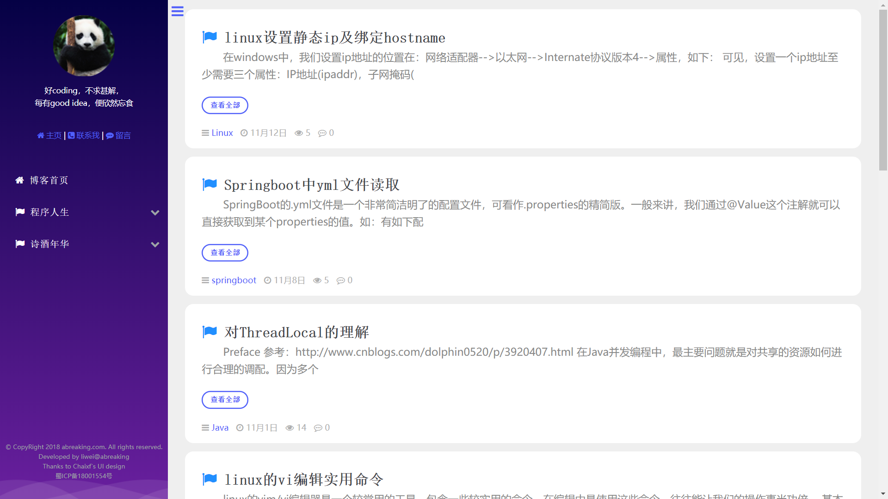

ABREAKING
================
本站地址：[blog.abreaking.com](http://blog.abreaking.com)

##网站名
李维的个人博客

##使用到的框架
JFinal-后台web框架
Maven-依赖属性管理

##作者
本站开发者：[李维](http://www.abreaking.com)
JPress框架开源者：[杨福海](http://www.yangfuhai.com)

##鸣谢
参考了[翁天信个人博客](https://blog.dandyweng.com/)设计风格
感谢chaixf同学帮助的UI设计

